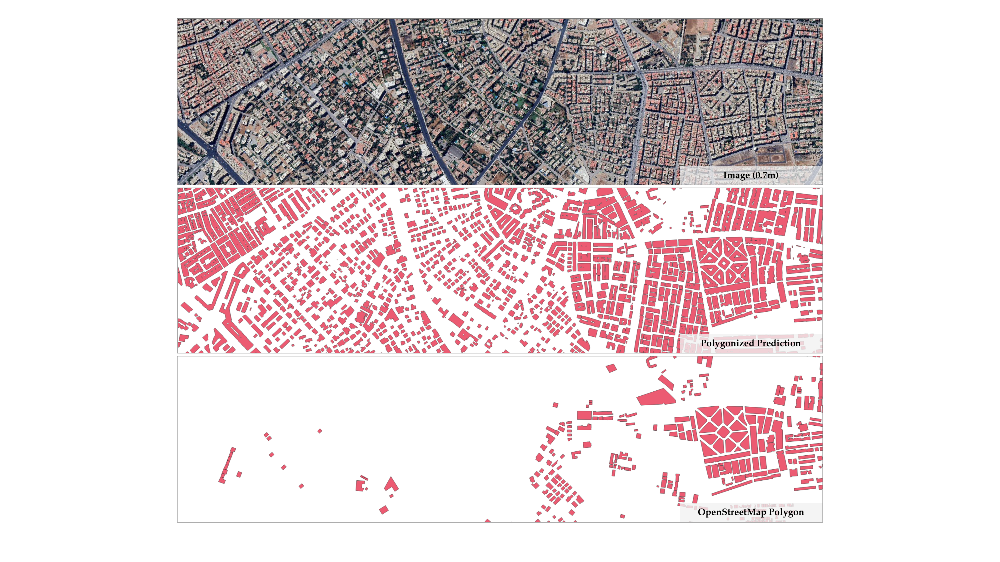

# UniBuild Standalone Inference

This folder contains the minimum code needed to run the trained **UniBuild DINOv3-Base HR-DPT** checkpoint for building mask inference on RGB optical remote sensing GeoTIFFs. It only keeps the DINOv3-Base backbone and HR-DPT decoder needed for the released model. It can also extract direction-aware building-instance polygons and corners from the predicted mask.



The folder is self-contained for inference and polygonization: it does not import code from the full UniBuild repository and does not require Building-Regulariser.

## Folder Layout

```text
unibuild_inference/
  infer_geotiff.py          # sliding-window GeoTIFF inference + optional polygonization
  instance_corner_extractor.py
  instance_corner_polygonizer.py
  requirements.txt
  README.md
  checkpoints/              # put model checkpoints here
  data/                     # put input RGB GeoTIFFs and outputs here
    outputs/                # default output directory
  models/                   # minimal local model code copied from UniBuild
```

## Checkpoints

Download the trained UniBuild checkpoint from either mirror:

- [Google Drive](https://drive.google.com/drive/folders/1YZ-bbXoZ1rOKQayRL79bLdhIE_CcU3K9?usp=drive_link)
- [Baidu Netdisk](https://pan.baidu.com/s/1ViHEDvAkf_VjdP8gAixANw) (extraction code: `unbd`)

Place the downloaded checkpoint under `checkpoints/` with the following filename:

```text
checkpoints/
  unibuild_dinov3_base_hrdpt.pth
```

This full checkpoint already contains the DINOv3-Base backbone and HLRDPT decoder weights, so a separate DINOv3 pretrained backbone checkpoint is not required for normal inference.
If you intentionally want to initialize the backbone before loading a partial checkpoint, pass it with `--backbone-checkpoint`.

## Installation

Create or activate a Python environment with PyTorch installed, then install the remaining dependencies:

```bash
pip install -r requirements.txt
```

If you only need raster mask inference and do not need vector footprint generation, OpenCV and Fiona can be omitted:

```bash
pip install numpy torch rasterio
```

## Building Mask Inference

Run sliding-window inference on an RGB GeoTIFF:

```bash
python infer_geotiff.py \
  --input data/input_rgb.tif \
  --save-prob
```

Outputs:

```text
data/outputs/input_rgb_mask.tif    # binary building mask, 0 background / 1 building
data/outputs/input_rgb_prob.tif    # optional float32 building probability
```

For images coarser than 1 m GSD, upsample to 1 m during inference:

```bash
python infer_geotiff.py \
  --input data/coarse_rgb.tif \
  --upsample-to-gsd 1.0
```

## Mask + Instance Polygonization

To generate the raster mask, direction-aware building polygons, and the polygonized raster mask:

```bash
python infer_geotiff.py \
  --input data/input_rgb.tif \
  --polygonize \
  --min-instance-area 9 \
  --connectivity 8
```

Outputs:

```text
data/outputs/input_rgb_mask.tif             # raw binary mask
data/outputs/input_rgb_buildings.gpkg        # instance polygons with corner vertices
data/outputs/input_rgb_mask_polygonized.tif  # rasterized direction-aware polygons
```

The polygonization pipeline separates connected building instances, simplifies their contours, removes redundant points using local and dominant directions, snaps eligible edges to the dominant building axes, and merges short corner transitions only when both turns have the same direction. The short-edge merge threshold is `8.0` pixels.

Useful polygonization options:

```bash
--connectivity 8
--min-instance-area 9
```

`--regularize` remains available as a compatibility alias for `--polygonize`.

The GeoPackage contains one feature per exterior building polygon with these attributes:

```text
inst_id    connected-component instance ID
area_px    source mask area in pixels
vertices   extracted exterior-corner count
angle_deg  dominant building direction
```

## Notes

- Input imagery should be RGB optical remote sensing imagery.
- The default RGB bands are `1 2 3`. Use `--rgb-bands` if your GeoTIFF stores RGB in a different order.
- The output GeoTIFFs preserve the inference grid CRS, transform, bounds, and size. If `--upsample-to-gsd` is used, the outputs are written on the upsampled grid.
- Use `--overwrite` to regenerate existing outputs.
